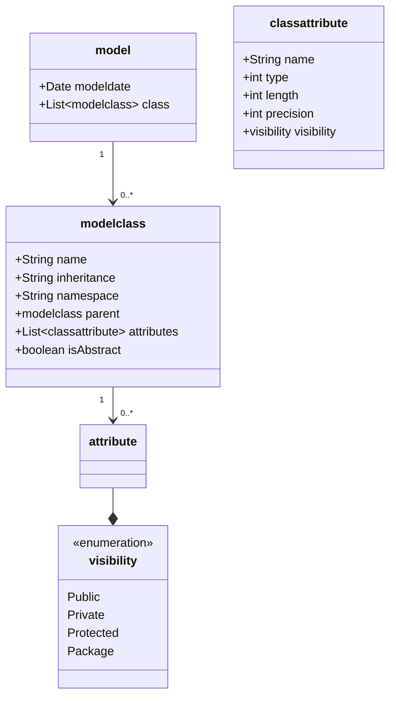

```mermaid
classDiagram
class modelclass {
    +String name
    +String inheritance
    +String namespace
    +modelclass parent
    +List~classattribute~ attributes
    +boolean isAbstract
}
class model {
    +Date modeldate
    +List~modelclass~ class
}
class classattribute {
    +String name
    +int type
    +int length
    +int precision
    +visibility visibility
}
class visibility {
    <<enumeration>>
    Public
    Private
    Protected
    Package
}
model "1" --> "0..*" modelclass
modelclass "1" --> "0..*" attribute
attribute --* visibility
```