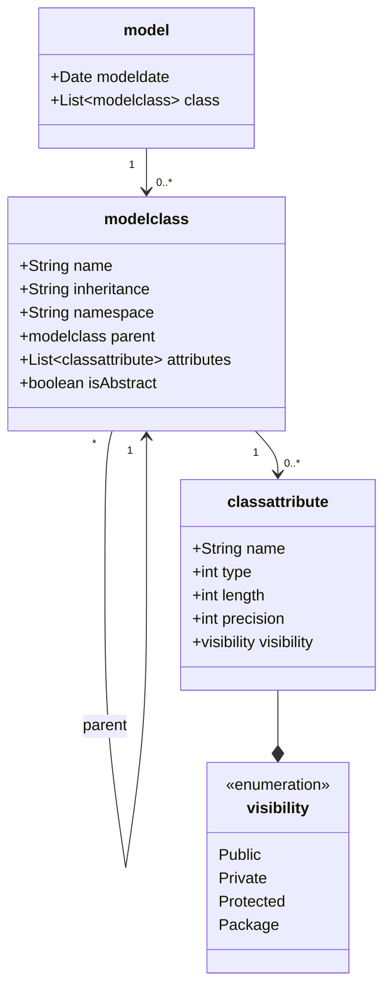
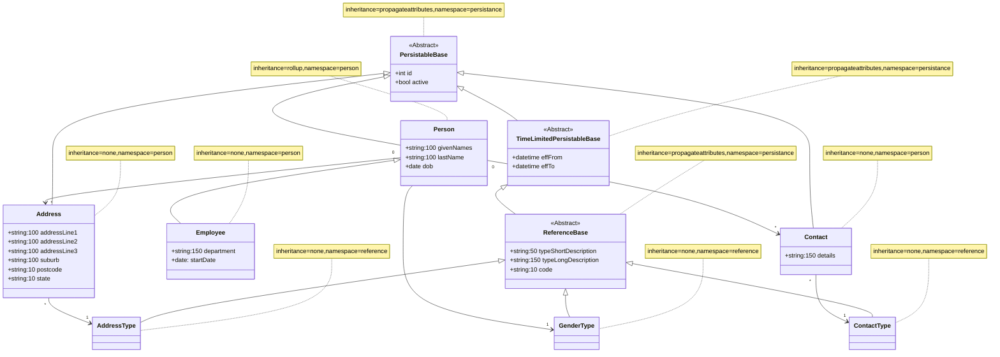

# Installation

The following assumes:

1. You have node installed;
2. You have tsc (the typescript compiler).

```
git clone https://github.com/philrwebb/Generation.git
cd Generation
npm install
tsc -w
node jsonModelGenerator.js
```

# Code Generation Part 1

Consider how to generate code artefacts from a model representing the data domain of an application. Code artefacts that you might generate include:

- Database persistance code (for sqlite | sqlserver | oracle | postgres . . .),
- Back-end persistence code (for dotnet | nodejs | php . . .),
- Back-end api (for dotnet | nodejs | php . . .)
- Front-end services to consume the api (for angular | svelte | react | vue . . .)
- Documentation for your model
- Unit, UI and Integration tests.

There is no guarantee that the selected modelling tool will always be supported so you need a way to move the model to a new tool with a minimum impact on the application.

What is the best approach?

I propose a two step approach that will insulate code generation from changes to the underlying modelling tool so that you only have to write your code generation once. The steps are:

1. Generate a 'standarised' version of your model that contains all of the information necessary to generate the code artefacts outlined above.
2. Use the 'standardised' version to generate those code artefacts.

It is worth noting that generation of code from a model describing the system supports the DRY principle of coding (Don't Repeat Yourself).

## The Standardised Model Types

```typescript
export type Class = {
  name: string;
  inheritance?: Inheritance;
  namespace?: string;
  parent?: string;
  attributes: Attribute[];
  isAbstract: boolean;
};

export type Attribute = {
  name: string;
  type: string;
  length?: number;
  precision?: number;
  visibility: Visibility;
};

export type Association = {
  name?: string;
  source: Endpoint;
  target: Endpoint;
};

export type Endpoint = {
  multiplicity: "0" | "1" | "*" | "n";
  role?: string;
  fkWinner?: boolean;
  class: string;
  navagability: boolean;
};

export enum Visibility {
  Public = "public",
  Private = "private",
  Protected = "protected",
}

export enum Inheritance {
  rollup = "rollup",
  propagateattributes = "propagateattributes",
  none = "none",
}

export type Model = {
  classes: Class[];
  associations: Association[];
};
```

## The Modelling Tool

[Mermaid](https://mermaid.js.org/syntax/classDiagram.html) is a JavaScript based diagramming and charting tool that renders Markdown-inspired text definitions to create and modify diagrams dynamically.

This is the diagram of the standardised model described using Mermaid:



It has the added benefit of being available for use in Markdown within vscode. I am using only the (static) class diagram in Mermaid. The definition for the model above is as follows:

```
classDiagram
class modelclass {
    +String name
    +String inheritance
    +String namespace
    +modelclass parent
    +List~classattribute~ attributes
    +boolean isAbstract
}
class model {
    +Date modeldate
    +List~modelclass~ class
}
class classattribute {
    +String name
    +int type
    +int length
    +int precision
    +visibility visibility
}
class visibility {
    <<enumeration>>
    Public
    Private
    Protected
    Package
}
model "1" --> "0..*" modelclass
modelclass "*" --> "1" modelclass: parent
modelclass "1" --> "0..*" classattribute
classattribute --* visibility
```

Following is the Mermaid 'code' that describes a Person Model which will be used to introduce some of the concepts of this framework:

```
---
Person Model
---
classDiagram
    note for PersistableBase "inheritance=propagateattributes,namespace=persistance"
    class PersistableBase {
        +int id
        +bool active
    }
    <<Abstract>> PersistableBase

    note for TimeLimitedPersistableBase "inheritance=propagateattributes,namespace=persistance"
    class TimeLimitedPersistableBase {
        +datetime effFrom
        +datetime effTo
    }
    <<Abstract>> TimeLimitedPersistableBase
    PersistableBase <|-- TimeLimitedPersistableBase

    note for ReferenceBase "inheritance=propagateattributes,namespace=persistance"
    class ReferenceBase {
        +string:50 typeShortDescription
        +string:150 typeLongDescription
        +string:10 code
    }
    <<Abstract>> ReferenceBase
    TimeLimitedPersistableBase <|-- ReferenceBase

    note for Person "inheritance=rollup,namespace=person"
    class Person {
        +string:100 givenNames
        +string:100 lastName
        +date dob
    }
    PersistableBase <|-- Person

    note for Employee "inheritance=none,namespace=person"
    class Employee {
        +string:150 department
        +date: startDate
    }
    Person <|-- Employee

    note for Address "inheritance=none,namespace=person"
    class Address {
        +string:100 addressLine1
        +string:100 addressLine2
        +string:100 addressLine3
        +string:100 suburb
        +string:10 postcode
        +string:10 state
    }
    PersistableBase <|-- Address

    note for Contact "inheritance=none,namespace=person"
    class Contact {
        +string:150 details
    }
    PersistableBase <|-- Contact
    Person "0" --> "*" Contact
    Person "0" --> "*" Address

    note for GenderType "inheritance=none,namespace=reference"
    class GenderType {
    }
    ReferenceBase <|-- GenderType
    Person "*" --> "1" GenderType

    note for AddressType "inheritance=none,namespace=reference"
    class AddressType {
    }
    ReferenceBase <|-- AddressType
    Address "*" --> "1" AddressType

    note for ContactType "inheritance=none,namespace=reference"
    class ContactType {
    }
    ReferenceBase <|-- ContactType
    Contact "*" --> "1" ContactType
```

The Person model described above renders like this:



This model defines some base types:

1. Abstract class PersistableBase which holds a couple of fields needed by all classes in the system - id and active (a boolean flag to support logical deletion)
2. Abstract class TimeLimitedPersistableBase inheriting from PersistableBase which is for inheriting types that need an effective from and effective to datetime
3. Abstract class ReferenceBase inheriting from TimeLimitedPersistableBase which is for inheriting types that are reference data and have a short and long description and code.

Because I will eventually need to create a relational database to represent concrete classes in my system and also because Mermaid does not let me otherwise specify how children will inherit from their parent, I have used the mermaid note to include a 'property collection' which includes inheritance and namespace. For these Abstract classes (there will never be a concrete class instantiated), the inheritance is set to propagateattributes which means any inheritors will get the attributes from the parent class. So all inheritors of PersistableBase will get an id and an active flag. An inheritor of TimeLimitedPersistableBase will get effFrom and effTo as well as active and id that are propagated from PersistableBase. ReferenceBase will get longDescription, shortDescription, code, effFrom, effTo, id and active

The first concrete class in this model is Person. Person will have an id and active flag (because it inherits from PersistableBase) and additionally: givenNames, lastName, dob. Person is associated with Contact (0.._) and with GenderType (_..1). These associations are also described in the text version of the model.

The code to generate a standardised json model is in jsonModelGenerator.ts in this project. The type definitions for this json model are contained within genmodel.ts.

The standardised json version of this model is as follows. There is enough information here to:

1. Generate the DDL to create a Database
2. Generate the DML to CRUD maintain this Database
3. Generate the backend Persistence layer to use DB CRUD
4. Generate the backend CRUD API to use this backend Persistence layer
5. Generate the frontend services to consume the API

You can late-bind on the language/framework to use and easily change between frameworks and even move to different DB systems.

```json
{
  "classes": [
    {
      "name": "PersistableBase",
      "inheritance": "propagateattributes",
      "namespace": "persistance",
      "parent": "",
      "attributes": [
        {
          "name": "id",
          "type": "int",
          "length": 0,
          "precision": 0,
          "visibility": "public"
        },
        {
          "name": "active",
          "type": "bool",
          "length": 0,
          "precision": 0,
          "visibility": "public"
        }
      ],
      "isAbstract": true
    },
    {
      "name": "TimeLimitedPersistableBase",
      "inheritance": "propagateattributes",
      "namespace": "persistance",
      "parent": "PersistableBase",
      "attributes": [
        {
          "name": "effFrom",
          "type": "datetime",
          "length": 0,
          "precision": 0,
          "visibility": "public"
        },
        {
          "name": "effTo",
          "type": "datetime",
          "length": 0,
          "precision": 0,
          "visibility": "public"
        }
      ],
      "isAbstract": true
    },
    {
      "name": "ReferenceBase",
      "inheritance": "propagateattributes",
      "namespace": "persistance",
      "parent": "TimeLimitedPersistableBase",
      "attributes": [
        {
          "name": "typeShortDescription",
          "type": "string",
          "length": 50,
          "precision": 0,
          "visibility": "public"
        },
        {
          "name": "typeLongDescription",
          "type": "string",
          "length": 150,
          "precision": 0,
          "visibility": "public"
        },
        {
          "name": "code",
          "type": "string",
          "length": 10,
          "precision": 0,
          "visibility": "public"
        }
      ],
      "isAbstract": true
    },
    {
      "name": "Person",
      "inheritance": "rollup",
      "namespace": "person",
      "parent": "PersistableBase",
      "attributes": [
        {
          "name": "givenNames",
          "type": "string",
          "length": 100,
          "precision": 0,
          "visibility": "public"
        },
        {
          "name": "lastName",
          "type": "string",
          "length": 100,
          "precision": 0,
          "visibility": "public"
        },
        {
          "name": "dob",
          "type": "date",
          "length": 0,
          "precision": 0,
          "visibility": "public"
        }
      ],
      "isAbstract": false
    },
    {
      "name": "Employee",
      "inheritance": "none",
      "namespace": "person",
      "parent": "Person",
      "attributes": [
        {
          "name": "department",
          "type": "string",
          "length": 150,
          "precision": 0,
          "visibility": "public"
        },
        {
          "name": "startDate",
          "type": "date",
          "length": null,
          "precision": 0,
          "visibility": "public"
        }
      ],
      "isAbstract": false
    },
    {
      "name": "Address",
      "inheritance": "none",
      "namespace": "person",
      "parent": "PersistableBase",
      "attributes": [
        {
          "name": "addressLine1",
          "type": "string",
          "length": 100,
          "precision": 0,
          "visibility": "public"
        },
        {
          "name": "addressLine2",
          "type": "string",
          "length": 100,
          "precision": 0,
          "visibility": "public"
        },
        {
          "name": "addressLine3",
          "type": "string",
          "length": 100,
          "precision": 0,
          "visibility": "public"
        },
        {
          "name": "suburb",
          "type": "string",
          "length": 100,
          "precision": 0,
          "visibility": "public"
        },
        {
          "name": "postcode",
          "type": "string",
          "length": 10,
          "precision": 0,
          "visibility": "public"
        },
        {
          "name": "state",
          "type": "string",
          "length": 10,
          "precision": 0,
          "visibility": "public"
        }
      ],
      "isAbstract": false
    },
    {
      "name": "Contact",
      "inheritance": "none",
      "namespace": "person",
      "parent": "PersistableBase",
      "attributes": [
        {
          "name": "details",
          "type": "string",
          "length": 150,
          "precision": 0,
          "visibility": "public"
        }
      ],
      "isAbstract": false
    },
    {
      "name": "GenderType",
      "inheritance": "none",
      "namespace": "reference",
      "parent": "ReferenceBase",
      "attributes": [],
      "isAbstract": false
    },
    {
      "name": "AddressType",
      "inheritance": "none",
      "namespace": "reference",
      "parent": "ReferenceBase",
      "attributes": [],
      "isAbstract": false
    },
    {
      "name": "ContactType",
      "inheritance": "none",
      "namespace": "reference",
      "parent": "ReferenceBase",
      "attributes": [],
      "isAbstract": false
    }
  ],
  "associations": [
    {
      "name": "Association_Person_Contact",
      "source": {
        "multiplicity": "0",
        "role": "",
        "class": "Person",
        "navagability": false
      },
      "target": {
        "multiplicity": "*",
        "role": "",
        "class": "Contact",
        "navagability": true
      }
    },
    {
      "name": "Association_Person_Address",
      "source": {
        "multiplicity": "0",
        "role": "",
        "class": "Person",
        "navagability": false
      },
      "target": {
        "multiplicity": "*",
        "role": "",
        "class": "Address",
        "navagability": true
      }
    },
    {
      "name": "Association_Person_GenderType",
      "source": {
        "multiplicity": "*",
        "role": "",
        "class": "Person",
        "navagability": false
      },
      "target": {
        "multiplicity": "1",
        "role": "",
        "class": "GenderType",
        "navagability": true
      }
    },
    {
      "name": "Association_Address_AddressType",
      "source": {
        "multiplicity": "*",
        "role": "",
        "class": "Address",
        "navagability": false
      },
      "target": {
        "multiplicity": "1",
        "role": "",
        "class": "AddressType",
        "navagability": true
      }
    },
    {
      "name": "Association_Contact_ContactType",
      "source": {
        "multiplicity": "*",
        "role": "",
        "class": "Contact",
        "navagability": false
      },
      "target": {
        "multiplicity": "1",
        "role": "",
        "class": "ContactType",
        "navagability": true
      }
    }
  ]
}
```
